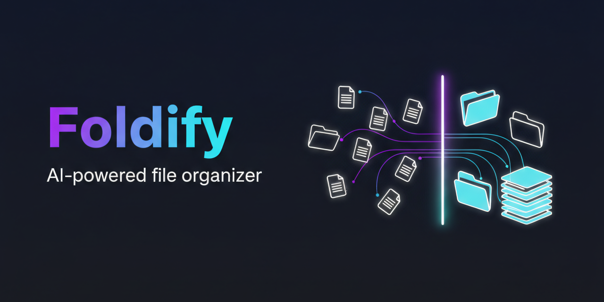
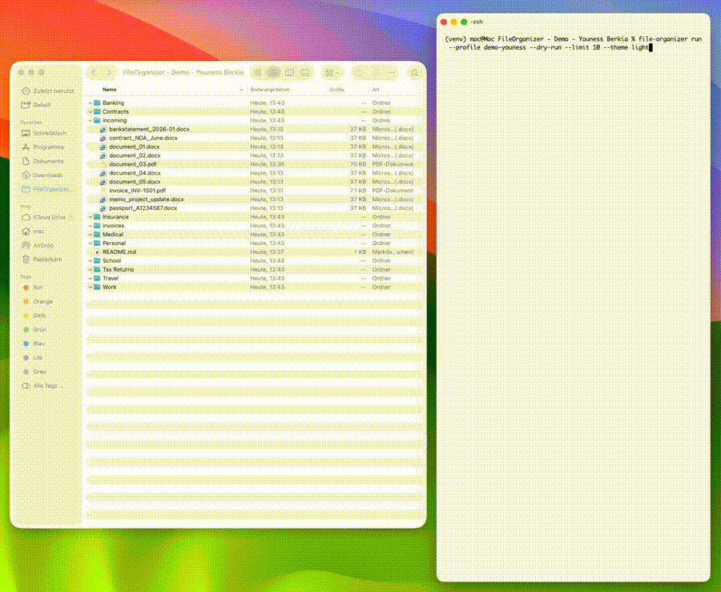

<p align="center">
  
</p>

<p align="center">
  
</p>

<h1 align="center">Foldify</h1>

<p align="center">
  <strong>The smart file organizer that runs locally, costs nothing, and respects your privacy.</strong>
</p>

<p align="center">
  <a href="https://github.com/YounessBerkia/foldify/actions/workflows/ci.yml">
    
  </a>
  <a href="https://www.python.org/downloads/">
    
  </a>
  <a href="LICENSE">
    
  </a>
  
  
  
</p>

---



## Why Foldify?

| Cloud-based organizers (Claude, OpenClaw, etc.) | **Foldify** |
|:---|:---|
| **Pay per file** — API tokens add up fast | **100% free** — runs entirely on your machine |
| **Upload everything** — slow, privacy risk | **Privacy-first** — your files never leave your device |
| **One-size-fits-all AI** | **Your rules, your way** — custom YAML profiles for *your* workflow |
| **File-by-file API latency** | **Blazing fast** — instant rule matching; AI fallback uses tiny local models |
| **Burns through tokens** | **Uses fraction of compute** — runs on `gemma3:1b` (~1GB), not 100B parameter cloud APIs |

**The smart workflow:** Use ChatGPT or Claude *once* to generate your YAML profile (e.g., "create a profile that sorts my Downloads into Work, Personal, and Archives"). Then let Foldify execute it **thousands of times instantly** — no tokens, no latency, no cloud dependency.

## What is Foldify?

Foldify organizes your files automatically using a layered approach: **fast rule-based matching first** (filename, extension, content, size, date, regex), with optional **local AI as a fallback** for ambiguous files. Everything runs 100% locally — no cloud, no subscriptions, no privacy trade-offs.

Unlike cloud-based "smart organizers" that process files one-by-one through expensive APIs, Foldify handles entire directories in seconds with zero ongoing costs.

## Key Features

| | |
|:---|:---|
| **Lightning fast** | Rule-based matching is instant. AI fallback uses lightweight local models (gemma3:1b, phi4:mini) that run circles around cloud APIs. |
| **Profile-based config** | Define multiple organization schemes in YAML — one for school, one for work, one for your desktop. |
| **Hierarchical rules** | Seven rule types evaluated in order: `filename_contains`, `extension`, `content_contains`, `size_range`, `date_range`, `regex`, `ai_match`. |
| **Local AI fallback** | Uses [Ollama](https://ollama.ai) models for smart classification when rules don't match. |
| **Safe by default** | Dry-run preview, automatic conflict backups, and full rollback support. |
| **Multi-source** | Scan multiple directories at once with include/exclude glob patterns. |
| **Zero ongoing costs** | Process 10,000 files for $0. Compare to ~$5-50+ with cloud AI tools. |

## Performance Comparison

| Model | Size | Speed per File vs Cloud API |
|:---|:---|:---|
| `gemma3:1b` | ~1 GB | ~50-100x faster — eliminates network latency entirely |
| `phi4:mini` | ~4 GB | ~20-50x faster — handles complex documents |
| `qwen3:8b` | ~5.5 GB | ~10-20x faster — best accuracy trade-off |

*Benchmarked on M2 Mac. Results vary by hardware, but local inference removes network round-trips completely.*

## Demo

> See `assets/demo.gif` for a quick walkthrough.

## Installation

```bash
git clone https://github.com/YounessBerkia/foldify.git
cd foldify
pip install -e .
```

For development:

```bash
pip install -e ".[dev]"
```

## Quick Start

```bash
# Set up config directories
foldify init

# See available profile templates
foldify init --list-templates

# Create a profile from a template
foldify init --template school --profile school

# Preview what would happen (no files moved)
foldify run --profile school --dry-run

# Adjust preview colors to your terminal background
foldify run --profile school --dry-run --theme dark
foldify run --profile school --dry-run --theme light

# Execute
foldify run --profile school
```

## Configuration

Profiles live in `~/.config/foldify/profiles/` as YAML files.

```yaml
name: school
sources:
  - path: ~/Downloads
    recursive: false

destinations:
  Math:
    path: ~/Documents/School/Math
    rules:
      - type: filename_contains
        keywords: [math, calculus, algebra]
      - type: extension
        extensions: [.pdf, .docx]

  Other:
    path: ~/Documents/School/Other
    rules:
      - type: ai_match
```

See [docs/CONFIGURATION.md](docs/CONFIGURATION.md) for the full profile reference and [examples/](examples/) for ready-to-use templates.

## AI Integration

Foldify uses [Ollama](https://ollama.ai) for optional local AI classification:

```bash
# Check Ollama status
foldify ai status

# Get setup instructions
foldify ai setup

# Use an AI-powered profile template
foldify init --template ai-smart --profile ai-smart
foldify run --profile ai-smart --dry-run
```

AI runs as a **fallback** — fast rule-based matching handles obvious cases first, and AI only kicks in for ambiguous files. This hybrid approach is what makes Foldify so efficient compared to pure AI solutions.

**Supported models:**

| Model | Size | Best For |
|:---|:---|:---|
| `gemma3:1b` | ~1 GB | Speed — process thousands of files instantly |
| `phi4:mini` | ~4 GB | Balance — fast and capable |
| `qwen3:8b` | ~5.5 GB | Accuracy — when you need the best classification |
| Any Ollama model | — | Fully configurable |

## Requirements

- Python 3.10+
- [Ollama](https://ollama.ai) *(optional, for AI features)*

## Documentation

- [Configuration Guide](docs/CONFIGURATION.md)
- [Troubleshooting](docs/TROUBLESHOOTING.md)
- [Example Profiles](examples/README.md)
- [Contributing](CONTRIBUTING.md)

## Development

```bash
# Run tests
pytest

# Format
black src/ tests/

# Lint
ruff check --fix src/ tests/

# Type check
mypy src/
```

## Project Structure

```
foldify/
├── src/foldify/        # Main package
│   ├── config/         # YAML loading & validation
│   ├── core/           # Organizer, scanner, executor
│   ├── rules/          # Rule engine
│   ├── ai/             # Ollama client
│   └── utils/          # Helpers
├── examples/           # Sample profiles
├── tests/              # Test suite
└── docs/               # Documentation
```

## License

MIT — see [LICENSE](LICENSE).
